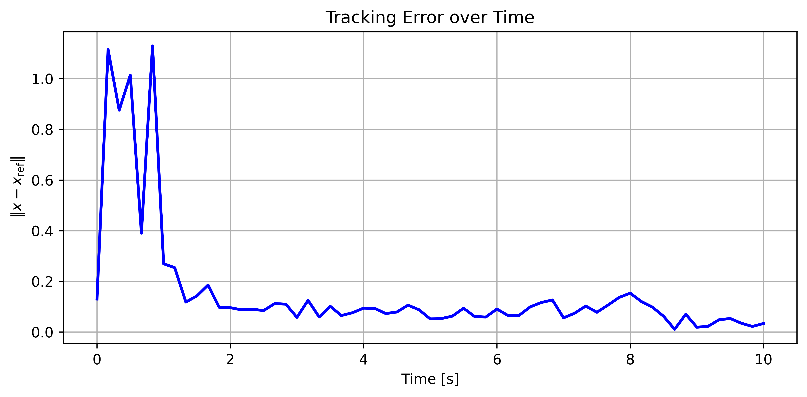
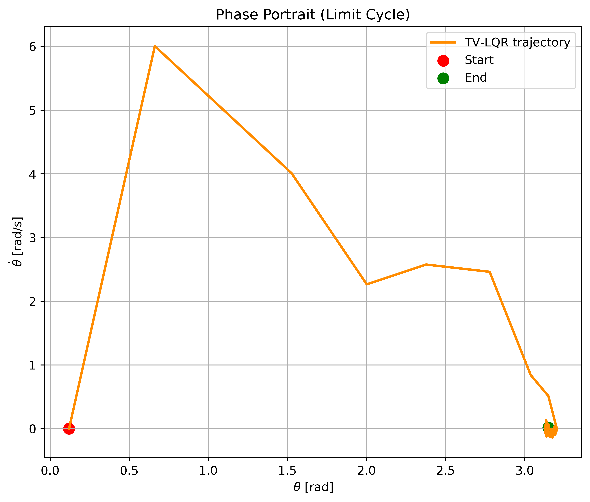
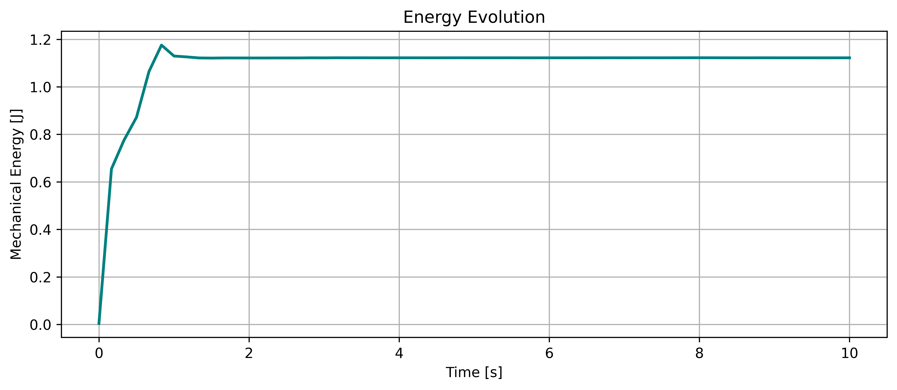
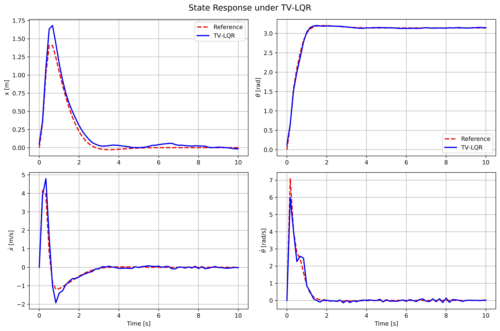

# Cart-Pole
Nonlinear cart-pole swing-up and stabilization using trajectory optimization and time-varying LQR (TV-LQR), including RK4 direct transcription, robustness under model mismatch/noise, , , , and .
